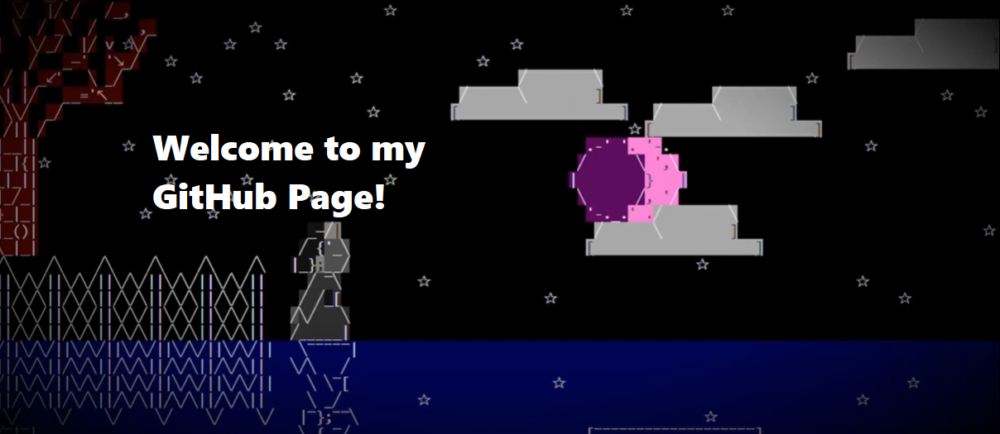

- I am a **full-stack developer** presently taking the backend developer program from the Bloomtech Institute of Technology.
- got started in Scratch (haha) but moved to **Java** in high school, **Python**, C++, and **Javascript** in college, and then more Java and JS through Bloomtech.
- I've been trained to use **AWS Services** such as the AWS Lambda, API, DynamoDB, CloudFormation, And S3 services.
- I've worked in **IntelliJ**, **Eclipse**, and **Visual Studio** as well.
- My favorite project to work on was one I did for fun: my **text game engine**, which you'll find among my repos along with a few **game demos**.
- I enjoy solving **logic problems** the most, and I'm very familiar with efficiency problems in particular.
